[⬅️ Back to Main Portfolio](https://www.amalrshah.com/home)
  
# Core Instructional Design Philosophy and Methodology
## 📜 My Philosophy
I approach instructional design as a process for ***engineering human performance***. By treating instructional design frameworks like ADDIE and 4-MAT as learning systems architecture, I build scalable enablement pipelines that minimize cognitive friction during the learning process. I've outlined my process below.
  
## 🎻 Orchestrating the Learning Development Lifecycle
### ADDIE & MVI
  * I implement and execute these instructional design and development lifecycle frameworks to build effective training events and "in-the-flow of work" enablement solutions.
  
     * **`Analyze-Design-Develop-Implement-Evaluate (ADDIE):`** The ADDIE framework is implemented for building formal and structured event-driven learning solutions such as virtual instructor-lead trainings (VILT), instructor-led trainings (ILT), solo e-learnings, hands-on labs & simulations, case studies, and peer-to-peer learning "bootcamps".
  
     * **`Minimum Viable Instruction (MVI):`** For agile design cycles, I use what I like to call ***Minimum Viable Instruction (MVI)*** enablement solutions for “just-in-time” and “in-the-flow of work” bite-sized consumable learning artifacts including microlearnings, short videos, Github "docs-as-code", job aids, and quick reference guides (QRGs).
  
## 📐 Designing the Learning Blueprint
### 4-MAT
  * I apply the **4-MAT Structure** (WHY, WHAT, HOW, WHAT-IF) to map the learner’s journey through the learning event or enablement solution.
   
  * 4-MAT is ***elastic:*** it is applicable for building formal and structured event-driven (scaled up) learning solutions and for building "in-the-flow-of work" (scaled out) enablement solutions.
  
## ⚛️ Optimizing the Learning “Physics” Engine
### Cognitive Load Theory (CLT)
  * By treating the learner’s attention and working memory as a highly constrained compute resource (RAM), I strive to filter out cognitive overload and ensure long-term retention by balancing *intrinsic*, *extraneous*, and *germane* cognitive load when building learning solutions.
  
    * **`Intrinsic and Extraneous Load Balancing:`** “Cleaning” and structuring complex data and information into easily digestible input chunks and learning pathways so human working memory is not overwhelmed (i.e., experiencing a buffer overrun).
  
    * **`Germane Load Balancing:`** Dedicating maximum attention to immediate hands-on application of learning materials during event-driven training (re: knowledge checks, hands-on labs/simulations, activities, peer-to-peer learning) and when consuming enablement solutions "in-the-flow-of-work" (re: step-by-step instructions, visual workflow diagrams, output validation signals to look for).
  
## 🔗 Architectural Synergy: 4-MAT & Cognitive Load Theory (CLT)
### Mapping the 4-MAT Macro-Architecture to the CLT Micro-Design Filter

## 🏗️ Building the Enablement Pipeline
### 70/20/10 Learning Ecosystem
  * **`70% - "In-the-Flow of Work" Enablement Solutions:`** This is the ***immediate*** “experiential layer” of the learning ecosystem where just-in-time MVI enablement solutions (re: “firmware updates”) are provided to remove blockers, thus avoiding the friction of context switching to a formal event-driven training session or a solo e-learning course.
  
  * **`20% - Communities of Practice:`** This is the “social layer” of the learning ecosystem where knowledge transfer occurs informally between peers, supported by infrastructure like Slack/Teams/Discord channels or informal micro-events like informational office hours, SME-led technical debriefs, and peer reviews.
  
  * **`10% - Formal, Structured Event-Driven Training Sessions:`** This as the “boot sequence” of the learning ecosystem to initialize baseline knowledge and skills and where scaled up event-driven training sessions are built and deployed. This "baseline layer" is the foundation of the learning ecosystem upon which the "experiental" and "social" layers exist. 
  
## 🧭 Visual Workflow: ADDIE Learning Development Lifecycle
### Building Formal and Structured Event-Driven Training Solutions

```mermaid
graph TD
    %% --- Phase 1: Analysis ---
    P1["<b><center>Phase 1: Analysis 🔎</center></b><br/><hr/><br/><center>Define Challenges.<br/><br/>Assess Learner Personas.<br/><br/>Identify Constraints.<br/><br/>Establish Metrics for Success.<br/><br/>Explore Solutions.</center>"]

    %% --- Phase 2: Design ---
    P2["<b><center>Phase 2: Design 📐</center></b><br/><hr/><br/><b><center>Apply 4-MAT</center></b><br/><br/><center><b>WHY</b><br/>Connect with the learners.<br/>What's in it for me (WIIFM)?<br/><br/><b>WHAT</b><br/>Provide knowledge and skills content.<br/>Guide the learning process.<br/><br/><b>HOW</b><br/>Learners practice what they've learned.<br/>Labs & Simulations.<br/>Peer-to-Peer Learning.<br/>Case Studies.<br/>Formative & Summative Assessments.<br/><br/><b>WHAT IF</b><br/>Enhancing Retention.<br/>Debriefs.<br/>Edge Cases.<br/>Additional Resources."]

    %% --- Phase 3: Develop ---
    P3["<b><center>Phase 3: Develop 🏗️</center></b><br/><hr/><br/><b>Apply Cognitive Load Theory while Building Learning Materials</b><br/><br/><b>Instrinsic Load Balancing</B><br/>Structure & Chunk Content.</br><br/><b>Extraneous Load Balancing</b><br/>Discrete Data.<br/>High Signal-to-Noise Ratio (SNR)<br/>'Clean' Information.<br/><br/><b>Germane Load Balancing</b><br/>Maximum Attention for Activities.<br/>Optimize for Hands On Application."]

    %% --- Phase 4: Implement ---
    P4["<b><center>Phase 4: Implement 🚀</center></b><br/><hr/><br/><b>Alpha --> Beta --> Gold Review</b><br/>Technical Validation by SME.<br/>Peer Review of Course Design.<br/>Test the Technology to Eliminate UI/UX Friction.<br/><br/><b>Prepare for Deployment</b><br/>Train-the-Trainer for Facilitators (VILT/ILT)."]

    %% --- Phase 5: Evaluate ---
    P5["<b><center>Phase 5: Evaluate 📈</center></b><br/><hr/><br/><b>Kirkpatrick's 4 Levels</b><br/><br/><b>L1:</b> Gather Immediate Feedback from Learners.<br/><br/><b>L2:</b> Assess Knowledge Retention via Transfer of Learning Assessments.<br/><br/><b>L3:</b> Evaluate Skill Application via Performance Reviews.<br/><br/><b>L4:</b> Measure the Delta: Compare Success Metrics BEFORE and AFTER the Training."]

    %% --- The Main Flow ---
    P1 ==> |Deployment Strategy:<br/>VILT, ILT, or Solo e-Learning| P2
    P2 ==> |Instructional Blueprint:<br/>Specs for Engineering the Content| P3
    P3 ==> |Testing & Validation:<br/>Pre-Flight Checks| P4
    P4 ==> |Deploy, Deliver, and Monitor| P5
    
    %% --- The Feedback Loop ---
    P5 ==>|Telemetry and Iteration for Next Deployment| P1

    %% --- Styling ---
    %% Using a progressive color scheme from cold (blue) to hot/live (green/orange)
    classDef init fill:#e6f7ff,stroke:#1890ff,stroke-width:2px,color:#000,rx:10,ry:10,text-align:left;
    classDef transfer fill:#f0f5ff,stroke:#6f42c1,stroke-width:2px,color:#000,rx:10,ry:10,text-align:left;
    classDef exec fill:#fff7e6,stroke:#fa8c16,stroke-width:2px,color:#000,rx:10,ry:10,text-align:left;
    classDef prod fill:#f6ffed,stroke:#52c41a,stroke-width:3px,color:#000,rx:10,ry:10,text-align:left;
    classDef eval fill:#e5d0e6,stroke:#751d78,stroke-width:3px,color:#000,rx:10,ry:10,text-align:left;

    class P1 init;
    class P2 transfer;
    class P3 exec;
    class P4 prod;
    class P5 eval;
```

## 🚀 Visual Workflow: Agile (MVI) Learning Development Lifecyle
### Building "In-the-Flow of Work" Enablement Solutions

```mermaid
graph TD
    %% --- Step 1: Gap Analysis ---
    P1["<b><center>Step 1: Gap Analysis 🔎</center></b><br/><hr/><br/><center>Identify Knowledge/Skill Gap.<br/><br/>Determine Source of Friction/Blocker.<br/><br/>Assess Learner Personas.<br/><br/>Identify Constraints.<br/><br/>Establish Metrics for Success.</center>"]

    %% --- Step 2: Design & Develop ---
    P2["<b><center>Step 2: Design & Develop 🛠️</center></b><br/><hr/><br/><b><center>Build the Enablement Solution applying the 4-MAT Structure.</b><br/><br/>Focus on Removing the Blocker and/or Reducing Friction.<br/><br/>Eliminate or Reduce Context Switching for the Learner.</center>"]

    %% --- Step 3: Deploy & Evaluate ---
    P3["<b><center>Step 3: Evaluate 📡</center></b><br/><hr/><br/><b><center>Monitor for Feedback after Deployment.</b><br/><br/>Measure the Delta: Compare Success Metrics BEFORE and AFTER the Solution has been Deployed.</center>"]

    %% --- The Main Flow ---
    P1 ==> |Enablement Solution:<br/>Microlearning, Video, QRG, or Github 'Docs-as-Code'| P2
    P2 ==> |Deploy and Monitor| P3

    %% --- The Feedback Loop ---
    P3 ==>|Iterate on Solution until Blocker/Friction is Removed| P1

    %% --- Styling ---
    %% Using a progressive color scheme from cold (blue) to hot/live (green/orange)
    classDef init fill:#e6f7ff,stroke:#1890ff,stroke-width:2px,color:#000,rx:10,ry:10,text-align:left;
    classDef transfer fill:#f0f5ff,stroke:#6f42c1,stroke-width:2px,color:#000,rx:10,ry:10,text-align:left;
    classDef exec fill:#fff7e6,stroke:#fa8c16,stroke-width:2px,color:#000,rx:10,ry:10,text-align:left;

    class P1 init;
    class P2 transfer;
    class P3 exec;
```

## 🤖 Tooling & AI Transparency
The core instructional design philosophy, methodology, and application of frameworks detailed in this repository are my original concepts and reflect my professional practice. To build this documentation repository, I utilized AI as a technical pair-programmer to refine the Markdown syntax, standardize/translate the ID-Engineering lexicon, and to generate the boilerplate Mermaid.js data visualizations.

---

[⬅️ Back to Main Portfolio](https://www.amalrshah.com/home)
